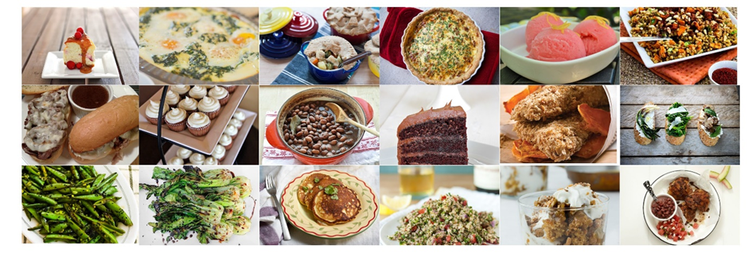
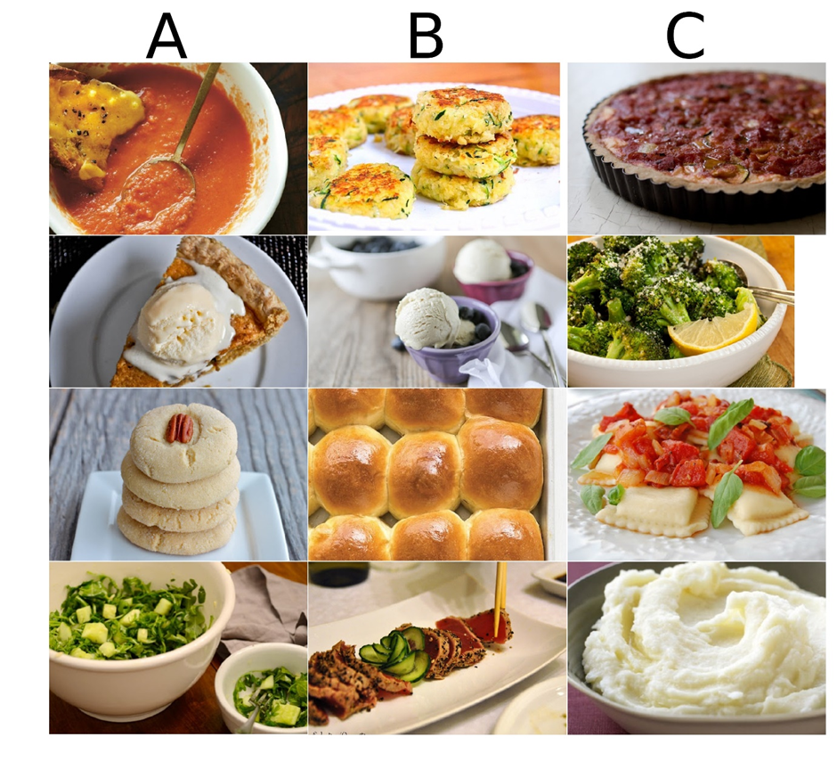

## Project Description

This project focuses on predicting food taste similarity using image-based analysis and human judgment. The dataset consists of 10,000 dish images, a sample of which is shown below:

Alongside the images, human-annotated triplets (A, B, C) are provided, where dish A is judged to be more similar in taste to dish B than to dish C. A sample of these triplets is displayed below:

The objective is to predict, for each unseen triplet, whether dish A is more similar in taste to dish B or C. This task utilizes PyTorch for deep learning, with recommendations to use pretrained vision models to handle the image analysis.

## Code Description

The code implements an image classification task using transfer learning. First, embeddings are created by inputting the dataset images into a pre-trained ResNet50 model, with the last layer removed to output 2048-dimensional feature vectors. Please mind that only the embeddings are stored in the .7z format in this repo. The dataset is then loaded and organized using `train_triplets.txt` into a `data_loader` object. 

A neural network is trained on top of these extracted embeddings, comprising three fully connected layers. The network introduces non-linearity using the ReLU activation function and employs dropout layers for regularization. Training is conducted using Stochastic Gradient Descent (SGD) and the Mean Squared Error (MSE) loss function, with a progressively decreasing learning rate to optimize performance.

The final pipeline uses Cross-Validation and achieved a public accuracy of 69.2%.